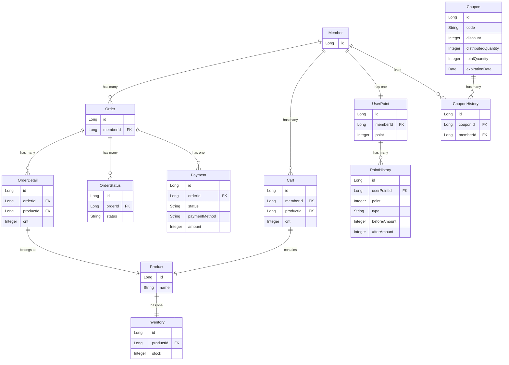

## ✨ ERD

```mermaid
erDiagram
    Member {
        Long id
    }
    Product {
        Long id
        String name
    }
    Order {
        Long id
        Long memberId FK
    }
    OrderDetail {
        Long id
        Long orderId FK
        Long productId FK
        Integer cnt
    }
    OrderStatus {
        Long id
        Long orderId FK
        String status
    }
    Cart {
        Long id
        Long memberId FK
        Long productId FK
        Integer cnt
    }
    UserPoint {
        Long id
        Long memberId FK
        Integer point
    }
    PointHistory {
        Long id
        Long userPointId FK
        Integer point
        String type
        Integer beforeAmount
        Integer afterAmount
    }
    Payment {
        Long id
        Long orderId FK
        String status
        String paymentMethod
        Integer amount
    }
    Inventory {
        Long id
        Long productId FK
        Integer stock
    }
    Coupon {
        Long id
        String code
        Integer discount
        Integer distributedQuantity
        Integer totalQuantity
        Date expirationDate
    }
    CouponHistory {
        Long id
        Long couponId FK
        Long memberId FK
    }

    Member ||--o{ Order : "has many"
    Order ||--o{ OrderDetail : "has many"
    OrderDetail ||--|| Product : "belongs to"
    Order ||--o{ OrderStatus : "has many"
    Member ||--o{ Cart : "has many"
    Cart ||--|| Product : "contains"
    Member ||--|| UserPoint : "has one"
    UserPoint ||--o{ PointHistory : "has many"
    Order ||--o{ Payment : "has one"
    Product ||--|| Inventory : "has one"
    Coupon ||--o{ CouponHistory : "has many"
    Member ||--o{ CouponHistory : "uses"

```