## ✨ 시나리오 선정 및 프로젝트 Milestone

- 시나리오: E-Commerce Service

## ✨ 시퀸스 다이어그램

### 📌 포인트 사용

```mermaid
sequenceDiagram
    participant Member as 사용자
    participant PointService as 포인트 서비스
    participant PointHistory as 포인트 내역

    Member ->> PointService: 포인트 사용 요청 (사용 금액)
    PointService ->> PointService: 유효성 검사 (금액 확인)

    alt 금액이 유효한 경우
        PointService ->> PointHistory: 포인트 사용 내역 기록
        PointHistory -->> PointService: 사용 내역 저장 완료
        PointService -->> Member: 사용 성공 응답
    else 금액이 유효하지 않은 경우
        PointService -->> Member: 사용 실패 응답 (에러 메시지)
    end
```

### 📌 장바구니 상품 추가

```mermaid
sequenceDiagram
    participant Member as 사용자
    participant Product as 상품
    participant Inventory as 재고
    participant Cart as 장바구니

    Member ->> Product: 상품 조회 요청 (상품 ID)
    Product ->> Member: 상품 상세 정보 반환

    Member ->> Cart: 장바구니에 상품 추가 요청 (상품 ID, 수량)
    Cart ->> Inventory: 상품 재고 확인 요청 (상품 ID)
    
    alt 재고 있음
        Inventory -->> Cart: 재고 충분
        Cart ->> Cart: 장바구니에 상품 추가
        Cart -->> Member: 상품 장바구니 추가 완료 응답
    else 재고 부족
        Inventory -->> Cart: 재고 부족
        Cart -->> Member: 장바구니 추가 실패 응답 (재고 부족 메시지)
    end

```

### 📌 주문 생성

```mermaid
sequenceDiagram
    participant Member as 사용자 (Member)
    participant Cart as 장바구니 (Cart)
    participant Order as 주문 (Order)

    Member ->> Cart: 장바구니 -> 주문 생성 요청
    Cart ->> Cart: 장바구니 비우기
    Cart ->> Order: 주문 생성 요청 (장바구니 데이터)
    Order -->> Member: 주문 생성 완료 응답 (주문 ID)

```

### 📌 주문 결제 요청

```mermaid
sequenceDiagram
    participant Member as 사용자
    participant Order as 주문
    participant Point as 포인트
    participant Payment as 결제 모듈
    participant Inventory as 재고

    Member ->> Order: 결제 요청 (주문 ID)
    Order ->> Point: 유저 포인트 확인 요청
    alt 포인트 부족
        Point -->> Order: 포인트 부족 응답
        Order -->> Member: 결제 실패 응답 (포인트 부족 메시지)
    else 포인트 충분
        Point ->> Point: 포인트 차감
        Point -->> Order: 포인트 확인 완료
        Order ->> Payment: 결제 요청 (결제 정보)
        alt 결제 성공
            Payment -->> Order: 결제 성공 응답
            Order ->> Order: 결제 상태 값 변경
            Order ->> Inventory: 재고 차감 요청
            Inventory -->> Order: 재고 차감 응답
            Order -->> Member: 결제 완료 응답 (결제 성공 메시지)
        else 결제 실패
            Payment -->> Order: 결제 실패 응답 (에러 코드)
            Order -->> Member: 결제 실패 응답 (실패 메시지)
        end
    end

```

### 📌 쿠폰 발급

```mermaid
sequenceDiagram
    participant Member as 사용자
    participant Queue as 대기열
    participant Coupon as 쿠폰

    Member ->> Queue: 쿠폰 발행 요청
    Queue ->> Queue: 요청 대기열에 추가
    Queue ->> Coupon: 대기열에서 요청 전달
    
    alt 쿠폰 발행 가능
        Coupon ->> Coupon: 쿠폰 발행 기록 생성
        Coupon -->> Member: 쿠폰 발행 성공 응답
    else 쿠폰 발행 불가
        Coupon -->> Member: 쿠폰 발행 실패 응답 (재고 부족 메시지)
    end

```

